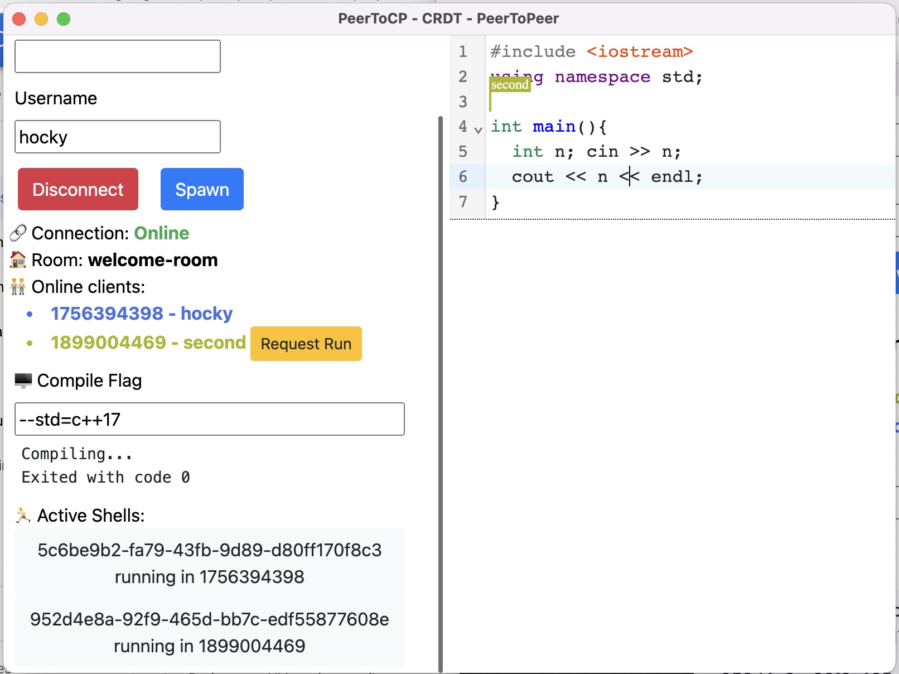
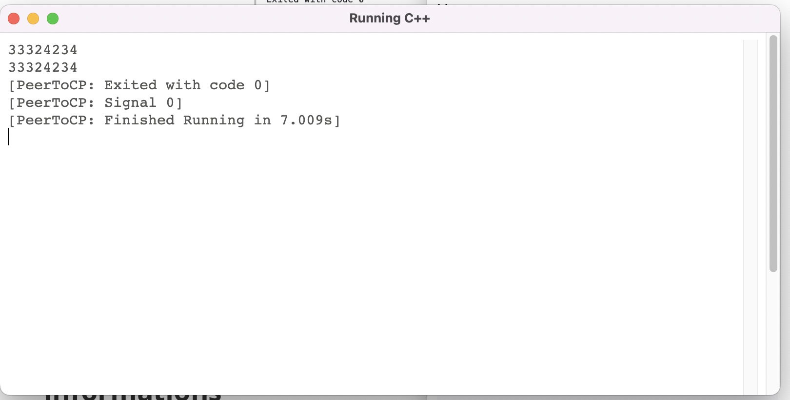

# PeerToCP

## User Interface and How to Interact



This is the interface when first running the app. When you don't enter any room you'll be automatically put into the room `welcome-room`, to set up a username, put it inside the input box, and reconnect by doing <strong style="color:red;">Disconnect</strong> by pressing the red button, and reconnect again by pressing the green <strong style="color:green;">Connect</strong> button.

You can code in C++, and compile it in your local by pressing the <strong style="color:blue;">Spawn</strong> Button, or compile it in other user's PC by pressing <strong style="color:orange;">Request Run</strong>. Next, there will be compile message showing up if it successfully compiled. See that this compile is cross-platform and can be run in Windows, GNU/Linux and MacOS.

Next, there will be some active shells showing at the bottom of the side bar. You can interact with it in real time interactively event if you are not the host of the program.



You can also run it in local and disconnect, while keeping the program running. This will auto update and still be running and can be interact with again after you reconnected.

## Informations

Electron Project for WebRTC Based Code Editor, Compiler, and C++ runner.
There are 3 versions of this app:

- CRDT Peer-to-Peer [Branch](https://github.com/hockyy/peertocp/tree/crdt-p2p)
  - [modified y-webrtc](https://github.com/hockyy/y-webrtc) for network provider
  - CRDT y-text for code editor
  - CRDT y-map for shell sharing

- CRDT Client-Server [Branch](https://github.com/hockyy/peertocp/tree/crdt-cs)
  - [modified y-websocket](https://github.com/hockyy/y-websocket) for network provider
  - CRDT y-text for code editor
  - CRDT y-map for shell sharing

- Operational Transformation Client-Server [Branch](https://github.com/hockyy/peertocp/tree/ot-cs)
  - Uses [own WebSocket server](https://github.com/hockyy/peertocp-server)
     - Utilizes [RPC-websockets](https://www.npmjs.com/package/rpc-websockets) for network provider
       - It creates an abstraction for RPC calling over a websocket connection
  - [@codemirror/collab OT](https://github.com/codemirror/collab), based on [Codemirror Collab Website Example](https://github.com/codemirror/website/tree/master/site/examples/collab) for code editor
  - Synchronized array for shell sharing

## Client Guide

Make sure the server is running, all the constant values and servers are defined on the top of the application.

```bash
npm install # To install all the requirements
npm start # To start the application
```

Make sure you are running this on an environment with a display hardware, else you may set up a dummy framebuffer, e.g [XVFB](https://www.x.org/wiki/).

Tests can be done and replicated with the similar followings set up script (need to adjust with the OS)

```bash
sudo apt install -y git wget screen nginx python-is-python3 g++ make
sudo apt install -y build-essential clang libdbus-1-dev libgtk2.0-dev \
                       libnotify-dev libgnome-keyring-dev libgconf2-dev \
                       libasound2-dev libcap-dev libcups2-dev libxtst-dev \
                       libxss1 libnss3-dev gcc-multilib g++-multilib libasound2 xvfb \
export DISPLAY=192.168.0.5:0.0
curl https://my-netdata.io/kickstart.sh > /tmp/netdata-kickstart.sh && sh /tmp/netdata-kickstart.sh
curl -o- https://raw.githubusercontent.com/nvm-sh/nvm/v0.39.2/install.sh | bash
source ~/.bashrc
nvm install 16
nvm use 16
git clone [URL]

xvfb-run npm start
```

## Server Guide

To set up a server, clone the repository

- [modified y-webrtc](https://github.com/hockyy/y-webrtc) for `crdt-p2p`
- [modified y-websocket](https://github.com/hockyy/y-websocket) for `crdt-cs`
- [own WebSocket server](https://github.com/hockyy/peertocp-server) for `ot-cs`

Make sure the server machine already got node installed, the working version that is used across all servers and clients are Node.js 16. You can set up nvm to set up and test other versions of Node.js. Run the server by using `npm start` in each server repository. To set up the server, make sure you allow client to talk with PORT 3000 of the machine.

If you are using NGINX, you can refer to this following configurations (need adjustment if doesn't work):

```nginx
location / {
	# First attempt to serve request as file, then
	# as directory, then fall back to displaying a 404.
	# try_files $uri $uri/ =404;
	proxy_pass http://127.0.0.1:3000;
  
	proxy_http_version  1.1;
	proxy_set_header Upgrade $http_upgrade;
	proxy_set_header Connection "upgrade";
	proxy_set_header Host $http_host;
	proxy_set_header X-Real-IP $remote_addr;
}
```

## End-To-End Benchmarking Guide

Uncomment the checker function at the below of the code

```js
// checker()
```

Set up the constants

```js
const testPlugins = null;
const currentTestScenario = null;
```

depending on which test you are currently running. For example if there exist a test plugin for scenario X, then put it in, to the variable, else just let it be `null`. For example when testing scenario 3:

```js
const testPlugins = scenarioThreePlugins;
const currentTestScenario = 3;
```

Pay attention that testPlugins is not calling the function because it is a function generator which later will be called when generating the CodeMirror's EditorState.

```js
const msLeft = Date.parse("2022-11-09T22:56:00.000+07:00") - Date.now()
```

Change this constant in the `checker` function to the time exactly you will want to start the test. Past time will start it immediately but weird behavior can happen if you put past from the current time.
